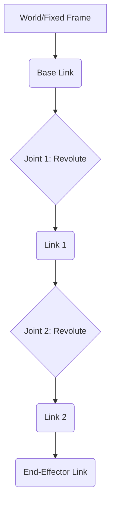

Now that you have Gazebo up and running and have experimented with basic object manipulation, it's time to elevate our virtual robotics capabilities. This chapter will guide you through the process of moving beyond simple shapes to creating a sophisticated, articulated model of a complete robot. In the interconnected world of ROS (Robot Operating System) and Gazebo, there are two primary, XML-based formats used for describing a robot's physical and functional structure: the **Unified Robot Description Format (URDF)** and the **Simulation Description Format (SDF)**. We will delve into both, detailing their syntax, capabilities, inherent limitations, and critically, when to use each for optimal results in your robotics projects. Understanding these formats is fundamental to building any robot in simulation.

### Understanding Robot Description Formats: The Blueprint of Your Robot

At its core, a robot is a complex assembly of interconnected components. To digitally represent this complexity, we use structured description files. Think of a robot description file as the comprehensive blueprint for your virtual robot, detailing every physical aspect and its relationship to other parts. These files define two fundamental entities:

-   **Links:** These represent the rigid parts of your robot (e.g., a chassis, a wheel, a robot arm segment, a sensor housing). Each link has several critical properties:
    *   **Geometry:** Describes the visual shape of the link. This is what you actually see in the simulator. It can be a basic primitive (box, sphere, cylinder) or a complex mesh imported from a CAD program (e.g., `.stl`, `.dae`).
    *   **Collision Properties:** Defines a simplified shape for the link that the physics engine uses to detect contact with other objects. This is often a simpler approximation of the visual geometry to reduce computational load during collision detection.
    *   **Inertial Properties:** Crucial for realistic physics simulation. These define the mass of the link, its center of gravity, and its inertia tensor (a 3x3 matrix describing how the mass is distributed around the center of gravity). Accurate inertial properties are vital for how the robot responds to forces and torques.

-   **Joints:** These are the connections between two links, defining how they move relative to each other. Joints are the essence of a robot's articulation and motion. They specify:
    *   **Type of Motion:** Determines the degrees of freedom (DOF) between the connected links (e.g., rotation, translation).
    *   **Limits:** Constraints on the joint's movement, such as angular or linear travel limits, maximum velocity, and maximum effort (torque/force).
    *   **Axis of Motion:** The vector along which the joint rotates or translates.
    *   **Parent and Child Links:** Every joint connects a "parent" link to a "child" link, establishing the robot's kinematic hierarchy.

### URDF: The ROS Standard for Kinematic Structures

URDF (Unified Robot Description Format) is the long-standing and widely adopted standard format for describing robot models within the ROS ecosystem. It is an XML-based format specifically designed for defining the kinematic and dynamic properties of a single robot. URDF excels at representing robots as a tree-like structure, making it ideal for visualizing robot poses in tools like Rviz and for planning robot motion.

**Key Characteristics and Use Cases of URDF:**
-   **Tree Structure Requirement:** A fundamental constraint of URDF is that a robot model *must* be a single tree. This implies several things:
    *   **No Closed Kinematic Loops:** You cannot directly model mechanisms with closed loops (e.g., a four-bar linkage) where multiple paths connect two links. Each link (except for the root link) must have exactly one parent.
    *   **Simplicity for ROS:** This tree structure is highly compatible with ROS's `robot_state_publisher`, which broadcasts the `tf` (transform) tree of the robot's joint states, essential for many ROS navigation and manipulation packages.
-   **ROS-Centric by Design:** URDF is deeply integrated with ROS. It is the format expected by many ROS tools and libraries for robot visualization (Rviz), motion planning (MoveIt!), and basic control.
-   **Limited Simulation Capabilities:** While excellent for defining kinematics and dynamics (mass and inertia), URDF has inherent limitations when it comes to comprehensive simulation. It lacks native tags for specifying advanced physics properties like detailed friction models, compliant contacts, damping coefficients for joints, or the intricate parameters required for sensor simulation. It also cannot describe environmental elements such as terrain, light sources, or multiple robots interacting in a single world. These limitations are where SDF becomes crucial.

**Basic URDF Structure: A Minimal Example**
A URDF file is always encapsulated within a single `<robot>` tag. Inside this, you define your `<link>` and `<joint>` elements.

Here is a minimal example showing a single, rectangular base link:
```xml
<?xml version="1.0"?>
<robot name="my_simple_robot">
  <link name="base_link">
    <!-- Visual properties define how the link appears in visualization tools -->
    <visual>
      <geometry>
        <box size="0.5 0.5 0.2"/> <!-- A box of 0.5m x 0.5m x 0.2m -->
      </geometry>
      <material name="blue">
        <color rgba="0 0 1 1"/> <!-- RGBA values: Red, Green, Blue, Alpha (transparency) -->
      </material>
    </visual>

    <!-- Collision properties define the simplified shape for physics interactions -->
    <collision>
      <geometry>
        <box size="0.5 0.5 0.2"/> 
      </geometry>
    </collision>

    <!-- Inertial properties define mass distribution for dynamic simulation -->
    <inertial>
      <mass value="1.0"/> <!-- Mass in kilograms -->
      <origin xyz="0 0 0" rpy="0 0 0"/> <!-- Center of mass relative to link origin -->
      <inertia ixx="0.01" ixy="0.0" ixz="0.0" iyy="0.01" iyz="0.0" izz="0.01"/> <!-- Inertia tensor -->
    </inertial>
  </link>
</robot>
```
**Breakdown of the URDF Link Elements:**
-   **`<visual>`:** This block defines the graphical representation of the link. It typically contains a `<geometry>` tag (specifying a `box`, `cylinder`, `sphere`, or referencing an external 3D `mesh` file like `.stl` or `.dae`). An optional `<material>` tag allows you to set the color (`rgba` values) and texture.
-   **`<collision>`:** This block specifies the geometry that the physics engine will use for collision detection. For computational efficiency, this is often a simpler shape than the visual geometry. If omitted, the physics engine might use the visual geometry or a default approximation.
-   **`<inertial>`:** This crucial block defines the link's physical properties: its `<mass>` (in kilograms) and its `<inertia>` tensor. The inertia tensor describes how the mass is distributed relative to the link's coordinate frame, impacting how the link accelerates and rotates under force. The `<origin>` sub-tag within `<inertial>` specifies the center of mass.

Now, let's extend our example by adding a second link (a wheel) and a joint to connect it to the base. This demonstrates how to build an articulated robot.

```xml
<?xml version="1.0"?>
<robot name="my_robot_with_wheel">
  <!-- Base Link Definition (as shown above) -->
  <link name="base_link">
    <!-- ... visual, collision, inertial ... -->
  </link>

  <!-- Wheel Link Definition -->
  <link name="wheel_link">
    <visual>
      <geometry>
        <cylinder radius="0.1" length="0.05"/> <!-- A cylinder representing a wheel -->
      </geometry>
      <material name="black">
        <color rgba="0 0 0 1"/>
      </material>
    </visual>
    <collision>
      <geometry>
        <cylinder radius="0.1" length="0.05"/>
      </geometry>
    </collision>
    <inertial>
      <mass value="0.2"/>
      <origin xyz="0 0 0" rpy="0 0 0"/>
      <inertia ixx="0.001" ixy="0.0" ixz="0.0" iyy="0.001" iyz="0.0" izz="0.002"/>
    </inertial>
  </link>

  <!-- Joint Definition to connect base_link and wheel_link -->
  <joint name="base_to_wheel_joint" type="continuous">
    <parent link="base_link"/> <!-- The base_link is the parent -->
    <child link="wheel_link"/>  <!-- The wheel_link is the child -->
    <!-- Position and orientation of the wheel relative to the base_link's origin -->
    <origin xyz="0 0.3 0" rpy="1.5707 0 0"/> 
    <axis xyz="0 1 0"/> <!-- The axis of rotation for the wheel -->
    <!-- <limit lower="-3.14" upper="3.14" velocity="10" effort="100"/> (Optional for non-continuous joints) -->
  </joint>
</robot>
```
**Breakdown of the URDF Joint Elements:**
-   **`name` and `type`:** Every joint must have a unique `name` and a `type` that defines its allowed motion. Common joint types include:
    *   `revolute`: A hinge joint that rotates around a single axis with defined upper and lower limits (e.g., a robotic elbow).
    *   `continuous`: Similar to `revolute`, but with no upper or lower limits, allowing continuous rotation (e.g., a wheel).
    *   `prismatic`: A sliding joint that translates along a single axis with defined limits (e.g., a linear actuator).
    *   `fixed`: A rigid connection that prevents any relative motion between the parent and child links. Often used to attach sensors or static parts.
    *   `floating`: Allows all 6 degrees of freedom (3 translational, 3 rotational) between the links, typically used for the base of a mobile robot.
-   **`<parent>` and `<child>`:** These tags explicitly define the two links connected by the joint, establishing the hierarchical relationship.
-   **`<origin>`:** This is a crucial tag that specifies the 3D pose (position and orientation) of the `child` link's coordinate frame relative to the `parent` link's coordinate frame.
    *   `xyz`: The translational offset (x, y, z coordinates in meters).
    *   `rpy`: The rotational offset, specified in roll, pitch, and yaw (Euler angles in radians). For a wheel, `rpy="1.5707 0 0"` (90 degrees around X-axis) might orient a cylinder correctly to act as a wheel.
-   **`<axis>`:** For `revolute` and `prismatic` joints, this defines the unit vector along which the motion occurs, in the joint's coordinate frame.

### SDF: The Comprehensive Gazebo Native Format

While URDF is robust for describing a single robot's kinematic structure, it falls short when it comes to describing a complete simulation *world* with all its complexities. This is where SDF (Simulation Description Format) shines. SDF is Gazebo's native format, and it is a superset of URDF's capabilities. It is also an XML format, but it is far more comprehensive, designed to describe everything about a simulation: multiple robots, static and dynamic objects, light sources, physics properties for the entire world, detailed sensor configurations, and even environmental elements like wind or fluid dynamics.

**Key Characteristics and Advantages of SDF:**
-   **Comprehensive World Description:** An SDF file can encapsulate an entire simulation scene, making it ideal for creating rich, interactive environments.
-   **Supports Kinematic Loops:** Unlike URDF, SDF can natively describe complex mechanical systems that include closed kinematic loops, which are common in many real-world robots and mechanisms.
-   **Gazebo-Specific Tags for High Fidelity:** SDF includes a rich set of tags specifically designed for fine-tuning Gazebo's simulation engine. These allow for detailed control over:
    *   Friction properties (e.g., `<mu>`, `<mu2>`).
    *   Damping and stiffness (`<kp>`, `<kd>`).
    *   Detailed sensor definitions (e.g., camera properties, LIDAR scan parameters).
    *   Hydrodynamics and aerodynamics.
-   **Standalone and Self-Contained:** An SDF file is a complete description that can be loaded directly into Gazebo without requiring any external tools or ROS dependencies, making it very portable.

**Converting URDF to SDF (and the Role of XACRO):**
When you load a URDF model into Gazebo, it's not actually using the URDF file directly. Gazebo automatically converts the URDF into an SDF representation internally. However, this automatic conversion can only infer default values for many of the Gazebo-specific tags that SDF supports. This means that if you rely solely on URDF and automatic conversion, you might miss out on fine-grained control over your simulation's physics and sensor behavior.

To achieve full control and leverage the power of SDF while still benefiting from URDF's ROS integration, you have two main approaches:
1.  **Create an SDF File from Scratch:** For simple static objects or environments, writing SDF directly is feasible.
2.  **Use `xacro` (XML Macros):** This is the more common and recommended approach for complex robots. `xacro` is an XML macro language that allows you to write more modular, readable, and powerful robot descriptions. You can use `xacro` to embed SDF-specific tags directly within your robot definition (often inside `<gazebo>` tags) and then process this `.xacro` file into either a pure URDF or a complete SDF file. This gives you the best of both worlds.

**Example of SDF-Specific Additions within a URDF (using a `<gazebo>` tag):**
You can augment a URDF file with Gazebo-specific properties by embedding them within a special `<gazebo>` tag. This tag usually includes a `reference` attribute that points to the link or joint it's modifying.

```xml
<robot name="my_robot">
  <link name="base_link">
    <!-- ... visual, collision, inertial ... -->
  </link>
  
  <!-- Gazebo-specific properties for base_link -->
  <gazebo reference="base_link">
    <material>Gazebo/Blue</material> <!-- Use a Gazebo-defined material -->
    <dampingFactor>0.1</dampingFactor> <!-- Add some linear damping -->
  </gazebo>

  <link name="wheel_link">
    <!-- ... visual, collision, inertial ... -->
  </link>

  <!-- Gazebo-specific properties for wheel_link -->
  <gazebo reference="wheel_link">
    <material>Gazebo/Black</material>
    <mu1>1.0</mu1> <!-- Friction coefficient 1 -->
    <mu2>1.0</mu2> <!-- Friction coefficient 2 -->
    <kp>1000000.0</kp> <!-- Stiffness for contact -->
    <kd>1.0</kd>     <!-- Damping for contact -->
  </gazebo>
  
  <joint name="base_to_wheel_joint" type="continuous">
    <!-- ... parent, child, origin, axis ... -->
  </joint>

  <!-- Gazebo-specific properties for the joint -->
  <gazebo reference="base_to_wheel_joint">
    <fudge_factor>0.1</fudge_factor> <!-- Adjust joint limits -->
    <provideFeedback>true</provideFeedback> <!-- Enable force/torque feedback -->
  </gazebo>
</robot>
```
In this extended example:
-   The `<gazebo>` tag, with its `reference` attribute, targets specific links (`base_link`, `wheel_link`) or joints (`base_to_wheel_joint`).
-   We've specified a Gazebo-defined material (e.g., `Gazebo/Blue`, `Gazebo/Black`), which might have predefined visual and physics properties.
-   For the wheel, we've set the friction coefficients (`mu1`, `mu2`) and contact parameters (`kp`, `kd`), which are crucial for realistic wheel-ground interaction.
-   For the joint, we added properties like `fudge_factor` to fine-tune joint behavior and `provideFeedback` to enable reading forces and torques acting on the joint.

### Visualizing the Robot Kinematics: An Example Diagram

To better illustrate the tree-like structure of a URDF, consider a simple two-link robot arm.


*Figure 2.1: A simplified kinematic tree diagram for a two-link robot arm. Each box represents a link, and each diamond represents a joint, illustrating the parent-child relationships.*

### Practical Exercise: Build a Four-Wheeled Robot with XACRO

Let's put this knowledge into practice by creating a more complex, yet modular, robot: a four-wheeled differential drive robot. We'll use `xacro` to avoid repetition and create a clean description.

1.  **Create the `four_wheel_robot.xacro` file:** Start a new file. The `.xacro` extension signals that this file will be processed by `xacro`. The root `<robot>` tag needs the `xmlns:xacro` namespace declaration.
    ```xml
    <?xml version="1.0"?>
    <robot name="four_wheel_robot" xmlns:xacro="http://www.ros.org/wiki/xacro">

      <!-- Define common constants using xacro:property -->
      <xacro:property name="chassis_mass" value="5.0"/>
      <xacro:property name="chassis_length" value="0.4"/>
      <xacro:property name="chassis_width" value="0.3"/>
      <xacro:property name="chassis_height" value="0.1"/>
      
      <xacro:property name="wheel_mass" value="0.2"/>
      <xacro:property name="wheel_radius" value="0.05"/>
      <xacro:property name="wheel_thickness" value="0.03"/>
      <xacro:property name="PI" value="3.14159265359"/>

      <!-- Base Link (Chassis) Definition -->
      <link name="base_link">
        <visual>
          <geometry>
            <box size="${chassis_length} ${chassis_width} ${chassis_height}"/>
          </geometry>
          <material name="chassis_color">
            <color rgba="0.8 0.2 0.2 1"/> <!-- Red chassis -->
          </material>
        </visual>
        <collision>
          <geometry>
            <box size="${chassis_length} ${chassis_width} ${chassis_height}"/>
          </geometry>
        </collision>
        <inertial>
          <mass value="${chassis_mass}"/>
          <origin xyz="0 0 0"/>
          <inertia ixx="${(chassis_mass/12) * (chassis_width*chassis_width + chassis_height*chassis_height)}" ixy="0.0" ixz="0.0"
                   iyy="${(chassis_mass/12) * (chassis_length*chassis_length + chassis_height*chassis_height)}" iyz="0.0"
                   izz="${(chassis_mass/12) * (chassis_length*chassis_length + chassis_width*chassis_width)}"/>
        </inertial>
      </link>

      <!-- XACRO Macro for a Wheel -->
      <xacro:macro name="wheel" params="prefix parent_link x_offset y_offset z_offset">
        <link name="${prefix}_wheel_link">
          <visual>
            <geometry>
              <cylinder radius="${wheel_radius}" length="${wheel_thickness}"/>
            </geometry>
            <material name="wheel_color">
              <color rgba="0.1 0.1 0.1 1"/> <!-- Dark gray wheel -->
            </material>
          </visual>
          <collision>
            <geometry>
              <cylinder radius="${wheel_radius}" length="${wheel_thickness}"/>
            </geometry>
          </collision>
          <inertial>
            <mass value="${wheel_mass}"/>
            <origin xyz="0 0 0"/>
            <inertia ixx="${(wheel_mass/12) * (3*wheel_radius*wheel_radius + wheel_thickness*wheel_thickness)}" ixy="0.0" ixz="0.0"
                     iyy="${(wheel_mass/12) * (3*wheel_radius*wheel_radius + wheel_thickness*wheel_thickness)}" iyz="0.0"
                     izz="${(wheel_mass/2) * (wheel_radius*wheel_radius)}"/>
          </inertial>
        </link>

        <joint name="${prefix}_wheel_joint" type="continuous">
          <parent link="${parent_link}"/>
          <child link="${prefix}_wheel_link"/>
          <origin xyz="${x_offset} ${y_offset} ${z_offset}" rpy="${PI/2} 0 0"/> <!-- Rotate 90 deg around X to make cylinder a wheel -->
          <axis xyz="0 0 1"/> <!-- Axis of rotation for a wheel -->
        </joint>
        
        <!-- Gazebo-specific properties for the wheel for realistic friction -->
        <gazebo reference="${prefix}_wheel_link">
          <material>Gazebo/Black</material>
          <mu1>1.0</mu1>
          <mu2>1.0</mu2>
          <kp>1000000.0</kp>
          <kd>1.0</kd>
        </gazebo>
        
        <!-- Joint transmission for ROS control -->
        <transmission name="${prefix}_wheel_transmission">
          <type>transmission_interface/SimpleTransmission</type>
          <joint name="${prefix}_wheel_joint">
            <hardwareInterface>hardware_interface/VelocityJointInterface</hardwareInterface>
          </joint>
          <actuator name="${prefix}_wheel_motor">
            <hardwareInterface>hardware_interface/VelocityJointInterface</hardwareInterface>
            <mechanicalReduction>1</mechanicalReduction>
          </actuator>
        </transmission>

      </xacro:macro>

      <!-- Instantiate the four wheels using the macro -->
      <xacro:wheel prefix="front_left" parent_link="base_link" x_offset="${chassis_length/4}" y_offset="${chassis_width/2 + wheel_thickness/2}" z_offset="0"/>
      <xacro:wheel prefix="front_right" parent_link="base_link" x_offset="${chassis_length/4}" y_offset="${-(chassis_width/2 + wheel_thickness/2)}" z_offset="0"/>
      <xacro:wheel prefix="back_left" parent_link="base_link" x_offset="${-chassis_length/4}" y_offset="${chassis_width/2 + wheel_thickness/2}" z_offset="0"/>
      <xacro:wheel prefix="back_right" parent_link="base_link" x_offset="${-chassis_length/4}" y_offset="${-(chassis_width/2 + wheel_thickness/2)}" z_offset="0"/>

    </robot>
    ```

**Breakdown of the `xacro` file elements:**
-   **`xmlns:xacro="http://www.ros.org/wiki/xacro"`:** This namespace declaration is essential for `xacro` processing.
-   **`<xacro:property name="..." value="..."/>`:** This allows you to define constants and variables within your `.xacro` file. This promotes reusability and makes it easy to change robot dimensions in one place. You can use these properties later with `${property_name}`.
-   **`<xacro:macro name="..." params="..."/>`:** This is the core feature of `xacro`. It allows you to define reusable blocks of XML (macros) that can take parameters. For our four-wheeled robot, we define a `wheel` macro that takes `prefix`, `parent_link`, and offsets as parameters.
-   **`${...}`:** This syntax is used to substitute the values of properties or macro parameters into the XML structure.
-   **`<xacro:wheel .../>`:** Each instance of this tag "calls" the `wheel` macro, generating a complete wheel link and joint with the specified parameters. This dramatically reduces repetition and improves readability.

We've also added `<gazebo>` tags within the macro to specify realistic friction properties for the wheels, and `<transmission>` tags, which are crucial for connecting the simulated joints to ROS controllers.

**Generating the URDF (or SDF) from XACRO:**
To convert this modular `.xacro` file into a standard `.urdf` file that ROS and Gazebo can use, you run the `xacro` command-line tool. You will need `ros-noetic-xacro` or equivalent for ROS 2 (`ros-humble-xacro`).
```bash
# For ROS 1 (Noetic example)
rosrun xacro xacro.py four_wheel_robot.xacro > four_wheel_robot.urdf

# For ROS 2 (Humble example)
ros2 run xacro xacro four_wheel_robot.xacro > four_wheel_robot.urdf
```
This command processes the `.xacro` file, expands all properties and macros, and outputs a single, complete `.urdf` file.

**Spawning Your XACRO-Generated Robot in Gazebo:**
Once you have generated the `four_wheel_robot.urdf` file, you can load and spawn this complex model into a running Gazebo simulation. This is typically done using ROS-Gazebo bridge tools.
```bash
# First, ensure Gazebo is running (e.g., `gazebo`)

# Then, in a new terminal, use the ROS-Gazebo spawn model command:
rosrun gazebo_ros spawn_model -file four_wheel_robot.urdf -urdf -model my_four_wheel_robot -x 0 -y 0 -z 0.5
```
*Explanation*:
*   `rosrun gazebo_ros spawn_model`: This is a ROS utility that interfaces with Gazebo to spawn models.
*   `-file four_wheel_robot.urdf`: Specifies the URDF file to load.
*   `-urdf`: Informs the tool that the input file is in URDF format.
*   `-model my_four_wheel_robot`: Assigns a unique name to the robot model within Gazebo.
*   `-x 0 -y 0 -z 0.5`: Sets the initial position of the robot in the Gazebo world. Placing it slightly above the ground (`z 0.5`) ensures it doesn't start in collision.

After executing this, your four-wheeled robot should appear in the Gazebo simulation, ready for further interaction and control.

### Conclusion

You now possess a comprehensive understanding of the roles and distinctions between URDF and SDF in describing robot models. You have mastered the basic syntax of links and joints, and, more importantly, you've learned how to leverage `xacro` to create modular, maintainable, and reusable robot descriptions. While URDF serves as the essential standard for ROS kinematics, SDF (often generated from extended XACRO files) is indispensable for detailed and high-fidelity simulation in Gazebo, allowing for fine-grained control over physics and sensors. In the next chapter, we will build upon this foundation by integrating more advanced simulated physics properties and equipping our robot model with a rich array of virtual sensors, bringing it even closer to behaving like its real-world counterpart.
